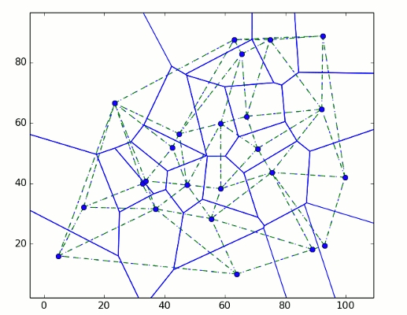

PyDelaunay2D
==============

A Simple Delaunay and Voronoi constructor in 2D. Written by [Jose M. Espadero](http://github.com/jmespadero)



Just pretend to be a simple and didactic implementation of the 
[Bowyer-Watson algorithm](https://en.wikipedia.org/wiki/Bowyer-Watson_algorithm)
to compute the [Delaunay triangulation](https://en.wikipedia.org/wiki/Delaunay_triangulation)
and the [Voronoi_diagram](https://en.wikipedia.org/wiki/Voronoi_diagram) of a set o 2D points.


It is written in pure python + [numpy](http://www.numpy.org/) (tested with 
python2.7 and python3). A test example is provided showing how to call and 
plot the results using matplotlib.

It support the [robust inCircle2D predicate](https://www.cs.cmu.edu/~quake/robust.html)
from Jonathan Richard Shewchuk, but it is disabled by default due to perfomance
penalties, so do not expect to work on degenerate set of points.
If you really need to compute triangulation on big or degenerate set of points, 
try [scipy.spatial.Delaunay](https://docs.scipy.org/doc/scipy/reference/generated/scipy.spatial.Delaunay.html) 
instead.

## So why?
Mainly, to provide a didactic implementation of the algorithm. You can use:
``` python 
for t in DT.triangles:        
    print(t, DT.triangles[t])
```
to show the current state of triangles and its neighbours.

Also, because sometimes it is not possible to import the complete scipy.spatial package 
(for example, when running a script inside of [blender](https://www.blender.org/) )

## References:
* https://en.wikipedia.org/wiki/Bowyer-Watson_algorithm
* https://en.wikipedia.org/wiki/Delaunay_triangulation
* http://www.geom.uiuc.edu/~samuelp/del_project.html
* https://docs.scipy.org/doc/scipy/reference/generated/scipy.spatial.Delaunay.html
* https://www.cs.cmu.edu/~quake/robust.html
